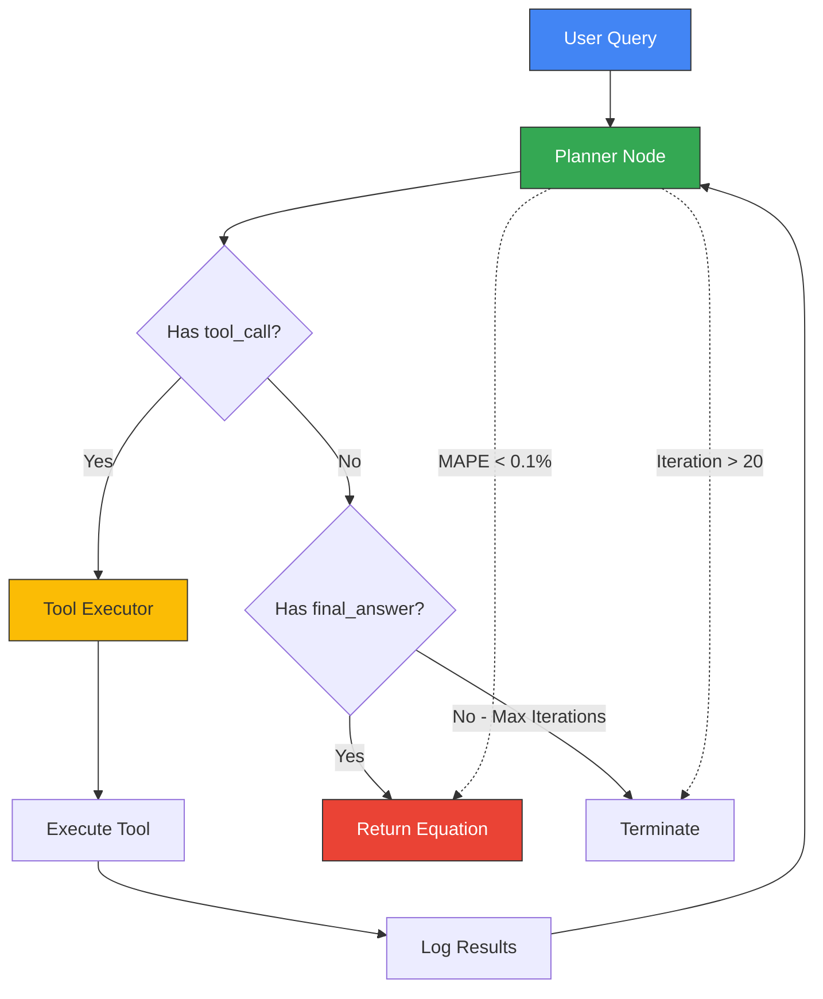

<p align="center">
  <h1 align="center">🔬 Equation Discovery Agent</h1>
  <p align="center">
    <em>An autonomous AI agent that discovers symbolic mathematical equations from raw numerical data using LLM-guided symbolic regression.</em>
  </p>
  <p align="center">
    
    
    
    
    
  </p>
</p>

---

##  Overview

The **Equation Discovery Agent** is an agentic AI system designed to automatically discover the underlying mathematical equations governing a given dataset. It combines the reasoning capabilities of large language models (Google Gemini) with the search power of symbolic regression (PySR) to iteratively explore, analyze, and converge on a closed-form mathematical expression that best describes the relationship between input variables and a target output.

Given a CSV dataset with input features and a target column, the agent autonomously:

1. **Inspects** the data via sandboxed Python execution to understand distributions, feature correlations, and noise characteristics.
2. **Visualizes** patterns by generating plots and analyzing them with a vision-enabled LLM sub-agent.
3. **Runs symbolic regression** using PySR with operator configurations informed by the prior analysis.
4. **Iterates** on results — adjusting operators, iteration counts, and population sizes — until the discovered equation achieves a **Mean Absolute Percentage Error (MAPE) below 0.1%**.

The entire process is orchestrated by a **LangGraph state machine** that loops between a Planner (LLM reasoning node) and a Tool Executor node until convergence or a maximum iteration limit is reached.

---

##  Architecture

```
┌─────────────────────────────────────────────────────────────────────┐
│                     EQUATION DISCOVERY AGENT                       │
│                                                                     │
│  ┌──────────┐     ┌──────────────────────┐     ┌────────────────┐  │
│  │  Data     │────▶│    Instance Preparer  │────▶│   Workspace    │  │
│  │  Source   │     │  (parse & extract)    │     │   /datasets/   │  │
│  └──────────┘     └──────────────────────┘     └───────┬────────┘  │
│                                                         │           │
│                    ┌────────────────────────────────────▼─────┐     │
│                    │         LangGraph State Machine          │     │
│                    │                                          │     │
│                    │   ┌────────────┐    ┌────────────────┐   │     │
│                    │   │  PLANNER   │───▶│ TOOL EXECUTOR  │   │     │
│                    │   │  (Gemini)  │◀───│                │   │     │
│                    │   └──────┬─────┘    └────────────────┘   │     │
│                    │          │                    │           │     │
│                    │     final_answer         ┌────┴────┐     │     │
│                    │          │               │  Tools  │     │     │
│                    │          ▼               │         │     │     │
│                    │       ┌──────┐   ┌──────┴───────┐ │     │     │
│                    │       │ END  │   │ • Python     │ │     │     │
│                    │       └──────┘   │   Sandbox    │ │     │     │
│                    │                  │ • PySR       │ │     │     │
│                    │                  │ • Visual     │ │     │     │
│                    │                  │   Subagent   │ │     │     │
│                    │                  └──────────────┘ │     │     │
│                    └──────────────────────────────────────────┘     │
│                                                                     │
│  ┌────────────────────────────────────────────────────────────────┐ │
│  │                    INFRASTRUCTURE LAYER                        │ │
│  │  WorkspaceManager │ ArtifactManager │ ScientificLogger        │ │
│  └────────────────────────────────────────────────────────────────┘ │
└─────────────────────────────────────────────────────────────────────┘
```

### Agentic Loop — Step by Step



1. **User Query** → The agent receives the dataset filename and target column.
2. **Planner** → Gemini Flash analyzes the current state (workspace files, experiment logs, previous results) and decides the next action.
3. **Tool Execution** → The selected tool runs and returns structured results.
4. **Feedback Loop** → Results are appended to the conversation history and experiment log. The Planner re-evaluates.
5. **Convergence** → The loop terminates when MAPE < 0.1% is achieved, or after 20 iterations.

---

##  Tool Suite

The agent has access to three specialized tools, each designed for a specific phase of the discovery pipeline:

### 1.  Python Interpreter (Sandboxed)

| Property | Detail |
|----------|--------|
| **Runtime** | Remote [E2B](https://e2b.dev/) cloud sandbox |
| **Purpose** | Exploratory data analysis, statistical profiling, visualization |
| **File Access** | Datasets are uploaded to `/home/user/` inside the sandbox |
| **Output Handling** | Generated files (plots, CSVs) are auto-downloaded to the local workspace |

The sandbox provides a fully isolated Python environment with `pandas`, `numpy`, `matplotlib`, and other scientific libraries pre-installed. Each execution creates a fresh sandbox instance — ensuring reproducibility and security.

**Example use cases:**
- Computing summary statistics (`df.describe()`)
- Correlation matrices and heatmaps
- Pairwise scatter plots to detect nonlinear relationships
- Histogram / distribution analysis for noise characterization

### 2. 📐 PySR — Symbolic Regression Engine

| Property | Detail |
|----------|--------|
| **Runtime** | Local (host machine via Julia backend) |
| **Library** | [PySR](https://github.com/MilesCranmer/PySR) — Python wrapper for SymbolicRegression.jl |
| **Input** | CSV filename + target column + operator configuration |
| **Output** | Best-fit symbolic equation + MAPE score |

PySR uses genetic programming and multi-population evolutionary search to discover closed-form mathematical expressions. The agent configures it with:

- **Binary operators**: `+`, `-`, `*`, `/`
- **Unary operators**: `exp`, `log`, `sqrt`, `sin`, `cos` (selected based on data analysis)
- **Iteration count** and **population size** (adjusted across retries)

The tool automatically handles NaN row removal, column validation, and reports the MAPE of the best discovered equation.

### 3.  Visual Subagent

| Property | Detail |
|----------|--------|
| **Runtime** | Google Gemini Vision API |
| **Purpose** | Analyze generated plots to extract scientific insights |
| **Output** | Structured JSON with observed patterns, functional form suggestions, noise characteristics, and symbolic regression recommendations |

The Visual Subagent acts as a "scientific eye" — it examines scatter plots, residual plots, and other visualizations to identify:
- Trend directions and periodicity
- Growth/decay patterns (exponential, polynomial, logarithmic)
- Asymptotic behavior and symmetry
- Noise levels and outlier presence
- Recommended operators and structural templates for PySR

---

##  Core Infrastructure

### Workspace Manager
Manages the agent's file system during execution:
- **`workspace/datasets/`** — Input CSV files prepared from the dataset source
- **`workspace/images/`** — Plots and visualizations generated during analysis
- **`workspace/executions/`** — Artifact directories for each tool execution
- Provides structured summaries injected into the LLM context each iteration

### Artifact Manager
Tracks all experiment artifacts with metadata:
- Creates unique execution directories per tool call
- Saves artifacts with automatic file-type detection (image, dataset, JSON, code)
- Maintains `artifacts.json` metadata per execution for provenance tracking

### Scientific Logger
Records the full experiment trail in append-only JSONL format:
- **Planner decisions** — LLM input/output and parsed actions
- **Tool calls** — Tool name, arguments, and structured results
- **Final results** — The converged equation
- Provides compact log summaries (last 10 entries) for LLM context injection

### Instance Preparer
Transforms raw benchmark dataset entries into agent-ready CSV files:
- Parses matrix/vector string representations from the source dataset
- Extracts input variables and target columns
- Writes clean CSV files to `workspace/datasets/`

### Cleanup
Resets the workspace to its original empty state after each run:
- Removes all generated datasets, images, execution artifacts, and logs
- Recreates empty directory structure for the next execution
- Ensures no state leaks between independent runs

---

##  Robustness Features

The agent is engineered for reliability in long-running autonomous sessions:

| Feature | Description |
|---------|-------------|
| **Exponential Backoff Retry** | Handles Gemini API rate limits (429) with 2ⁿ second delays, up to 5 retries |
| **Empty Response Recovery** | Detects and retries when the LLM returns empty content (safety filters, context overflow) — up to 3 attempts with 10s cooldown |
| **Loop Detection** | Identifies repetitive LLM outputs using sliding-window chunk comparison and skips degenerate iterations |
| **Sliding Window Context** | Keeps only the first message + last 11 messages to prevent context window overflow across long runs |
| **Robust JSON Extraction** | Balanced-brace scanning that finds the outermost valid JSON object, plus markdown code fence fallback |
| **Graceful Degradation** | Short non-JSON responses are treated as final answers; long non-JSON responses trigger a retry |
| **Max Iteration Guard** | Hard cap at 20 iterations to prevent runaway execution |
| **Auto-convergence** | Automatically stops and returns the equation when MAPE drops below 0.1% |
| **Unknown Arg Absorption** | PySR tool silently ignores hallucinated LLM arguments (e.g., `max_size`, `iterations`) via `**kwargs` |

---

##  Project Structure

```
.
├── app/
│   ├── main.py                    # Entry point — prepares data, builds graph, runs agent
│   ├── prepare_instance.py        # Dataset extraction and CSV preparation
│   ├── cleanup.py                 # Post-run workspace reset
│   │
│   ├── agents/
│   │   └── graph.py               # LangGraph state machine (Planner + Tool Executor)
│   │
│   ├── core/
│   │   ├── workspace_manager.py   # File system management for workspace
│   │   ├── artifact_manager.py    # Experiment artifact tracking & metadata
│   │   └── logger.py              # JSONL experiment logger with LLM-friendly summaries
│   │
│   ├── prompts/
│   │   ├── SystemPrompt.py        # Main system prompt for the Planner LLM
│   │   └── ToolPrompt.py          # Vision analysis prompt for the Visual Subagent
│   │
│   ├── tools/
│   │   ├── Sandbox.py             # E2B sandboxed Python interpreter
│   │   ├── pySRTool.py            # PySR symbolic regression wrapper
│   │   └── visual_subagent.py     # Gemini Vision-based plot analyzer
│   │
│   └── workspace/                 # Runtime workspace (auto-managed)
│       ├── datasets/              # Prepared CSV files
│       ├── images/                # Generated plots
│       └── executions/            # Tool execution artifacts
│
├── data/
│   └── lsr_synth_matsci_train.csv # Source benchmark dataset
│
├── .env                           # API keys (GOOGLE_API_KEY, E2B_API_KEY)
├── pyproject.toml                 # Project metadata and dependencies
└── .gitignore
```

---

##  Setup & Installation

### Prerequisites

- **Python 3.10+**
- **[uv](https://docs.astral.sh/uv/)** (recommended) or `pip` for dependency management
- **Julia** (required by PySR's backend — auto-installed on first PySR run)
- A **Google AI API key** ([Get one here](https://aistudio.google.com/apikey))
- An **E2B API key** ([Get one here](https://e2b.dev/))

### 1. Clone the Repository

```bash
git clone <repository-url>
cd equation-discovery-agent
```

### 2. Create the Environment

Using `uv` (recommended):

```bash
uv venv
uv sync
```

Or using `pip`:

```bash
python -m venv .venv
# Windows
.venv\Scripts\activate
# macOS/Linux
source .venv/bin/activate

pip install -e .
```

### 3. Configure API Keys

Create a `.env` file in the project root:

```env
GOOGLE_API_KEY=your_google_api_key_here
E2B_API_KEY=your_e2b_api_key_here
```

>  **Never commit `.env` to version control.** It is already listed in `.gitignore`.

### 4. Verify PySR Installation

PySR requires Julia. On first run, it will auto-install the Julia backend. To pre-install:

```bash
python -c "import pysr; pysr.install()"
```

---

##  Usage

### Running the Agent

```bash
cd app
python main.py
```

The agent will:
1. Load the specified instance from the source dataset
2. Prepare a clean CSV in `workspace/datasets/`
3. Build the LangGraph planner ↔ tool executor loop
4. Iteratively analyze data and run symbolic regression
5. Print the discovered equation when MAPE < 0.1% is achieved

### Configuring the Target Instance

Edit `app/main.py` to change the target instance:

```python
instance_id = "lsr_synth_matsci_matsci0"  # Change this to your target instance
```

### Example Output

```
============================================================
[PLANNER] Iteration #1  |  2026-05-04 12:00:00 UTC
============================================================
[PLANNER] Loading workspace context...
[PLANNER] Sending 4 messages to LLM...
[PLANNER] Dispatching tool: 'python_interpreter'
------------------------------------------------------------
[TOOL]    Running: 'python_interpreter'
[SANDBOX] Uploaded: lsr_synth_matsci_matsci0.csv
[SANDBOX] Executing Python code (245 chars)...
          stdout: <statistical summary>
------------------------------------------------------------

============================================================
[PLANNER] Iteration #3  |  2026-05-04 12:01:30 UTC
============================================================
[PLANNER] Dispatching tool: 'pysr'
[PYSR]    Running symbolic regression...
          Best equation: x0 * exp(x1)
          MAPE: 0.042%
[STOP]    MAPE < 0.1% target achieved. Auto-stopping.

========== FINAL RESULT ==========

x0 * exp(x1)
```

---

##  Dependencies

| Package | Purpose |
|---------|---------|
| `langchain` | LLM abstraction layer |
| `langchain-google-genai` | Google Gemini integration |
| `langgraph` | State machine orchestration for the agent loop |
| `pysr` | Symbolic regression via genetic programming |
| `e2b-code-interpreter` | Cloud-sandboxed Python execution |
| `datasets` | HuggingFace datasets for benchmark loading |
| `python-dotenv` | Environment variable management |
| `pandas` / `numpy` | Data manipulation (used by PySR and instance preparation) |

---

##  Benchmark Dataset

The agent is designed to work with the **LSR-Synth-MatSci** benchmark — a synthetic dataset of materials science equations. Each instance contains:

- **Instance ID** — Unique identifier (e.g., `lsr_synth_matsci_matsci0`)
- **Input variables** — Feature column names
- **Output variable** — Target column name
- **Training data** — Numerical matrices/vectors encoded as strings

The `prepare_instance.py` module handles parsing these string-encoded matrices into clean CSV files suitable for analysis.

---

##  Execution Lifecycle

```
1. PREPARE    →  Parse instance → Extract CSV → Save to workspace/datasets/
2. BUILD      →  Construct LangGraph (Planner ↔ Tool Executor)
3. LOOP       →  Planner reasons → Dispatches tool → Logs result → Repeat
4. CONVERGE   →  MAPE < 0.1% achieved → Return equation
5. CLEANUP    →  Reset workspace to empty state for next run
```

---

##  License

This project is provided for research and educational purposes.

---

<p align="center">
  <em>Built with  LangGraph,  PySR, and  Google Gemini</em>
</p>
